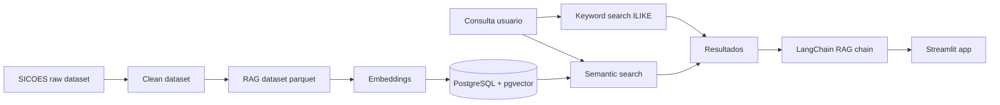
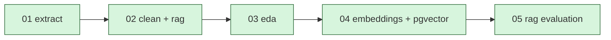

# Sistema RAG para SICOES

Proyecto de monografia de diplomado para construir un sistema inteligente de recuperacion semantica de convocatorias publicas del portal SICOES de Bolivia mediante NLP, embeddings, PostgreSQL + pgvector, LangChain y Retrieval-Augmented Generation.

## Descripcion

El proyecto busca comparar tres modos de consulta sobre convocatorias publicas:

* `keyword search`: busqueda tradicional con SQL e `ILIKE`.
* `semantic search`: busqueda por similitud vectorial usando embeddings multilingues almacenados en PostgreSQL con `pgvector`.
* `RAG answer generation`: recuperacion de contexto y respuesta generada por un LLM orquestado con LangChain.

## Arquitectura

```text
Parquet RAG dataset
→ PostgreSQL Docker container
→ pgvector extension
→ embeddings almacenados en PostgreSQL
→ vector similarity search using pgvector
→ SQL baseline search using ILIKE
→ LangChain RAG chain
→ Streamlit app
```

LangChain se mantiene como capa de orquestacion para desacoplar la logica de recuperacion y permitir cambiar de proveedor de LLM con cambios minimos.

### Diagrama



## Estructura

```text
.
├── app/
│   └── streamlit_app.py
├── db/
│   └── init/
│       └── 01_init_pgvector.sql
├── data/
│   ├── processed/
│   ├── rag/
│   └── raw/
├── docs/
├── notebooks/
│   ├── 01_extract_sicoes.ipynb
│   ├── 02_clean_transform_rag.ipynb
│   ├── 03_eda.ipynb
│   ├── 04_embeddings_pgvector.ipynb
│   └── 05_rag_evaluation.ipynb
├── outputs/
├── src/
├── .env.example
├── docker-compose.yml
├── pyproject.toml
└── uv.lock
```

## Setup

1. Crear el entorno virtual con `uv`:

```bash
uv venv .venv
source .venv/bin/activate
uv sync
```

Nota para equipos sin GPU dedicada:

* Este proyecto fuerza `torch` desde el índice CPU-only de PyTorch cuando usas `uv sync`.
* Si ya viste descargas de paquetes `nvidia-*`, lo más probable es que correspondan a una instalación previa o a una resolución anterior del entorno.
* En ese caso conviene recrear el entorno:

```bash
rm -rf .venv
uv venv .venv
source .venv/bin/activate
uv sync --refresh
```

2. Alternativa compatible con `venv` usando `pyproject.toml`:

```bash
python3 -m venv .venv
source .venv/bin/activate
pip install -e .
```

En instalación manual con `pip`, `sentence-transformers` puede arrastrar una variante de `torch` más pesada. Si tu equipo es CPU-only, prioriza el flujo con `uv`.

3. Crear variables de entorno:

```bash
cp .env.example .env
```

## PostgreSQL + pgvector

Levantar la base de datos:

```bash
docker compose up -d
```

Verificar contenedores:

```bash
docker compose ps
```

Verificar que PostgreSQL acepta conexiones:

```bash
docker compose exec postgres pg_isready -U postgres -d sicoes_rag
```

Probar una consulta minima:

```bash
docker compose exec postgres psql -U postgres -d sicoes_rag -c "SELECT 1;"
```

Ver logs del servicio:

```bash
docker compose logs postgres
```

Seguir logs en vivo:

```bash
docker compose logs -f postgres
```

La configuracion base es:

* base de datos: `sicoes_rag`
* usuario: `postgres`
* password: `postgres`
* puerto en contenedor: `5432`
* puerto en host por defecto: `5433`
* embedding por defecto: `sentence-transformers/paraphrase-multilingual-MiniLM-L12-v2`

Si tu equipo ya usa `5432`, este proyecto expone PostgreSQL en `5433` por defecto. Si quieres cambiarlo otra vez, ajusta `POSTGRES_HOST_PORT` en `.env` y mantén `DATABASE_URL` sincronizada.

Nota para PostgreSQL 18+:

* Estas imagenes esperan que el volumen se monte en `/var/lib/postgresql`, no en `/var/lib/postgresql/data`.
* Si ya arrancaste antes con una configuracion anterior y el contenedor entra en reinicio, recrea el almacenamiento local del proyecto:

```bash
docker compose down
rm -rf db/postgres_data
docker compose up -d
```

Usa ese borrado solo si no necesitas conservar una base local previa.

Si solo quieres detener la base:

```bash
docker compose down
```

Si quieres recrearla desde cero por un cambio de version o esquema local:

```bash
docker compose down
rm -rf db/postgres_data
docker compose up -d
docker compose exec postgres pg_isready -U postgres -d sicoes_rag
```

El script [db/init/01_init_pgvector.sql](/var/www/codigo/maestria_ia/umsa/diplomados_intermedios/dip_03/db/init/01_init_pgvector.sql) crea la extension `vector`, la tabla `convocatorias` y sus indices iniciales.

## Notebooks

Flujo sugerido:

1. [01_extract_sicoes.ipynb](/var/www/codigo/maestria_ia/umsa/diplomados_intermedios/dip_03/notebooks/01_extract_sicoes.ipynb): descarga y guarda el dataset crudo.
2. [02_clean_transform_rag.ipynb](/var/www/codigo/maestria_ia/umsa/diplomados_intermedios/dip_03/notebooks/02_clean_transform_rag.ipynb): limpieza, normalizacion canonica y construccion de `texto_rag`.
3. [03_eda.ipynb](/var/www/codigo/maestria_ia/umsa/diplomados_intermedios/dip_03/notebooks/03_eda.ipynb): analisis exploratorio del dataset limpio y generacion de figuras en `outputs/figures/`.
4. [04_embeddings_pgvector.ipynb](/var/www/codigo/maestria_ia/umsa/diplomados_intermedios/dip_03/notebooks/04_embeddings_pgvector.ipynb): base para carga en PostgreSQL y generacion de embeddings.
5. [05_rag_evaluation.ipynb](/var/www/codigo/maestria_ia/umsa/diplomados_intermedios/dip_03/notebooks/05_rag_evaluation.ipynb): evaluacion comparativa de modos de busqueda.

Si cambias `EMBEDDING_MODEL`, debes reejecutar completamente el notebook `04_embeddings_pgvector.ipynb` para regenerar e insertar embeddings consistentes con el nuevo modelo.

Variables utiles para RAG:

* `LLM_PROVIDER=gemini|openai`
* `LLM_MODEL=<modelo>`
* `LLM_TEMPERATURE=0.1`
* `DEFAULT_RETRIEVAL_MODE=keyword|semantic|hybrid`
* `RAG_MAX_CONTEXT_CHARS=12000`
* `GOOGLE_API_KEY=` o `OPENAI_API_KEY=`
* `NTFY_ENABLED=true`, `NTFY_SERVER=https://ntf.sh`, `NTFY_TOPIC=...` si quieres notificaciones al terminar procesos largos

Estado actual del flujo:

* `01_extract_sicoes.ipynb`: completado.
* `02_clean_transform_rag.ipynb`: completado y corregido.
  * `objeto_contratacion` ya se extrae desde la columna correcta del raw.
  * `modalidad` ya reconoce casos como `CND1`.
* `03_eda.ipynb`: completado y validado sobre el dataset corregido.
* `04_embeddings_pgvector.ipynb`: funcional, con carga validada en PostgreSQL; pendiente refinar relevancia semantica.
* `05_rag_evaluation.ipynb`: implementado con dataset curado de queries y export de resultados.
* `src/rag_chain.py`: implementado con retrieval configurable y proveedor LLM configurable.

## Utilidad Tampermonkey

Para acelerar la descarga manual de anexos de SICOES, el repositorio incluye un userscript de Tampermonkey en [docs/code/sicoes_download_dbc.user.js](/var/www/codigo/maestria_ia/umsa/diplomados_intermedios/dip_03/docs/code/sicoes_download_dbc.user.js:1).

Este script agrega un boton flotante `Descargar DBC visibles` y hace click automatico sobre los enlaces visibles cuyo texto sea `Documento Base de Contratacion`, con una pausa configurable entre descargas. La consola del navegador muestra el orden y el `CUCE` de cada descarga disparada.

Cuando exportes el log CSV del userscript y tengas una carpeta con archivos descargados de nombres aleatorios, puedes renombrarlos localmente con [scripts/rename_sicoes_downloads.py](/var/www/codigo/maestria_ia/umsa/diplomados_intermedios/dip_03/scripts/rename_sicoes_downloads.py:1).

Ejemplo:

```bash
python3 scripts/rename_sicoes_downloads.py \
  --downloads-dir /ruta/a/descargas \
  --log-csv /ruta/a/sicoes_dbc_log.csv \
  --output-dir /ruta/a/dbc_renombrados
```

Por defecto el script hace `dry-run`. Para aplicar cambios reales usa `--apply`; para copiar en vez de mover usa `--copy`.

Si el log de Tampermonkey tiene mas filas que archivos realmente descargados, el script ya no falla por defecto. Procesa los pares disponibles y deja el resto marcado como `missing_download` en `rename_manifest.csv`. Si quieres comportamiento estricto, usa `--strict-counts`.

En terminal interactiva, el script muestra una barra de progreso por archivo.

El renombrado contempla `pdf`, `docx`, `doc` y `rar`.

## Extracción documental

Para construir un corpus enriquecido desde `pdf`, `docx`, `doc` o `rar` con documentos ofimaticos dentro, el repositorio incluye [scripts/extract_documents_to_text.py](/var/www/codigo/maestria_ia/umsa/diplomados_intermedios/dip_03/scripts/extract_documents_to_text.py:1).

Recomendación de formato:

* usar `txt` como formato canónico de extracción para el pipeline
* reservar `markdown` sólo como formato opcional de lectura humana

`txt` es preferible porque evita meter ruido de marcado en embeddings y simplifica trazabilidad, limpieza y concatenación documental.

Ejemplo:

```bash
python3 scripts/extract_documents_to_text.py \
  --input-dir data/external/curated_docs \
  --output-dir data/intermediate/curated_docs_text
```

El script:

* extrae `pdf` con `pdftotext`
* extrae `docx` con `pandoc`
* extrae `doc` con `libreoffice`
* descomprime `rar` con `unrar` y procesa los documentos soportados encontrados dentro
* preserva estructura relativa de carpetas
* genera `extraction_manifest.csv`
* marca `warning_low_text` cuando el archivo parece escaneado o requiere OCR
* intenta detectar `CUCE` desde el nombre y desde el contenido para dejar trazabilidad de coincidencia en el manifest
* muestra barra de progreso por archivo cuando se ejecuta en terminal interactiva

Campos utiles del `extraction_manifest.csv`:

* `archive_member`: nombre interno del archivo si vino desde un `rar`
* `filename_cuce`: CUCE detectado en el nombre del archivo
* `content_cuce`: CUCE detectado dentro del texto extraido
* `cuce_match`: `match`, `mismatch`, `missing_content_cuce`, `missing_filename_cuce` o `not_checked`

## Auditoria de descargas curadas

Para cruzar el renombrado con la extraccion y detectar faltantes o posibles corrimientos, el repositorio incluye [scripts/audit_downloads.py](/var/www/codigo/maestria_ia/umsa/diplomados_intermedios/dip_03/scripts/audit_downloads.py:1).

Ejemplo:

```bash
python3 scripts/audit_downloads.py \
  --rename-manifest data/external/curated_docs/rename_manifest.csv \
  --extraction-manifest data/intermediate/curated_docs_text/extraction_manifest.csv \
  --output-path outputs/audit/download_audit.csv
```

Estados principales del auditor:

* `content_match`: el CUCE esperado aparece en el contenido extraido
* `content_cuce_missing`: no se detecto CUCE en el contenido; frecuente en plantillas DBC
* `content_mismatch`: el contenido expone un CUCE distinto al esperado
* `missing_download`: hubo fila en el log sin archivo descargado
* `missing_extraction`: el archivo no aparece en el manifest de extraccion
* `warning_low_text`: el documento parece escaneado o requiere OCR

El auditor también muestra barra de progreso por fila en terminal interactiva.

## Notificaciones reutilizables

El proyecto incluye una utilidad reusable en [src/notifications.py](/var/www/codigo/maestria_ia/umsa/diplomados_intermedios/dip_03/src/notifications.py:1) para enviar mensajes a `ntfy` o `ntf.sh`.

Variables de entorno:

* `NTFY_ENABLED=true|false`
* `NTFY_SERVER=https://ntf.sh`
* `NTFY_TOPIC=mi-canal`
* `NTFY_TOKEN=` opcional

Uso mínimo:

```python
from src.notifications import send_ntfy_notification

result = send_ntfy_notification(
    "Extraccion completada.",
    title="SICOES pipeline",
    tags=["white_check_mark", "python"],
    priority=3,
)

print(result.success, result.detail)
```

La función no levanta excepciones de red; devuelve un resultado estructurado para que el caller decida si registrar el error o ignorarlo.

Adicionalmente, los scripts operativos guardan un resumen local por corrida en `outputs/run_summaries/`:

* un JSON por ejecución con timestamp
* un `history.jsonl` acumulado
* un archivo `*_latest.json` por script

Cada resumen incluye al menos:

* `timestamp_utc`
* `hostname`
* `script`
* `success`
* `elapsed_seconds`
* `summary`
* `error`

## Corpus enriquecido

Con los textos ya extraídos, puedes construir un corpus RAG enriquecido con [scripts/build_enriched_corpus.py](/var/www/codigo/maestria_ia/umsa/diplomados_intermedios/dip_03/scripts/build_enriched_corpus.py:1).

Ejemplo:

```bash
python3 scripts/build_enriched_corpus.py \
  --texts-dir data/intermediate/curated_docs_text \
  --output-path data/processed/curated/curated_corpus_enriched.parquet \
  --csv-output-path data/processed/curated/curated_corpus_enriched.csv
```

El builder:

* toma `data/rag/sicoes_convocatorias_rag.parquet` como base
* detecta `CUCE` y tipo documental desde el nombre del archivo extraído
* agrega columnas separadas como `dbc_text`, `convocatoria_text`, `ficha_text`
* construye `texto_rag_base` y `texto_rag_enriched`
* genera un reporte `*_unmatched.csv` para documentos que no pudo asociar al corpus base

Nota de consistencia:

* `04_embeddings_pgvector.ipynb` sigue siendo válido como notebook de ingestión, pero sus ejemplos de retrieval pueden quedar históricos respecto a los ajustes posteriores en `src.vector_store`.
* La referencia final para comparar `keyword`, `semantic` y `hybrid` es `05_rag_evaluation.ipynb` junto con `outputs/evaluation_summary.csv`.



## Contrato de datos actual

El proyecto mantiene dos niveles de datos persistidos:

* `data/processed/sicoes_convocatorias_clean.parquet`: dataset limpio canonico.
* `data/rag/sicoes_convocatorias_rag.parquet`: dataset preparado para retrieval con `texto_rag`.

Reglas vigentes:

* `parquet` es el artefacto principal versionado para `processed` y `rag`.
* Los `csv` generados por notebooks se consideran export auxiliares locales.
* La normalizacion agresiva usada para frecuencia de palabras en el EDA no modifica el dataset canonico.
* `texto_rag` conserva texto natural y enriquecido para retrieval, no una version sobrelimpia.
* El corpus indexado para retrieval parte del dataset RAG completo dentro del alcance vigente.
* La evaluacion experimental se separa sobre consultas etiquetadas, no sobre documentos tipo clasificacion supervisada.
* El embedding por defecto prioriza cobertura multilingue en espanol sin cambiar la dimension `vector(384)` del esquema actual.
* El paso `clean` aplica un filtro de CUCE canónico; actualmente deja fuera 5 filas del `raw` por formato inconsistente con el patrón esperado.

Splits previstos para evaluacion:

* `data/evaluation/queries_dev.csv`
* `data/evaluation/queries_val.csv`
* `data/evaluation/queries_test.csv`

Contrato minimo esperado para cada query de evaluacion:

* `query_id`
* `query_text`
* `relevant_cuce`
* `metadata_filters` opcional en formato `campo=valor;campo2=valor2`

Artefactos actuales:

* `data/evaluation/queries_dev.csv`
* `data/evaluation/queries_val.csv`
* `data/evaluation/queries_test.csv`
* `outputs/evaluation_results.csv` generado por el notebook `05`
* `outputs/evaluation_summary.csv` generado por el notebook `05`

Nota de trazabilidad actual:

* `data/raw/sicoes_convocatorias_raw.parquet`: `1433` filas
* `data/processed/sicoes_convocatorias_clean.parquet`: `1429` filas
* `data/rag/sicoes_convocatorias_rag.parquet`: `1429` filas
* 5 registros de `raw` quedan fuera del dataset canónico porque su `CUCE` no coincide con el regex usado en `02_clean_transform_rag.ipynb`: `^\\d{2}-\\d{4}-\\d{2}-\\d{6,}-\\d-\\d$`

## Capa `src/`

La capa productiva debe consumir rutas y contratos centralizados:

* [src/config.py](/var/www/codigo/maestria_ia/umsa/diplomados_intermedios/dip_03/src/config.py): rutas canonicas, constantes de retrieval y configuracion por entorno.
* [src/data_loader.py](/var/www/codigo/maestria_ia/umsa/diplomados_intermedios/dip_03/src/data_loader.py): carga de datasets `processed`, `rag` y queries de evaluacion.

Convenciones actuales:

* `load_rag_dataset()` y `load_retrieval_corpus()` priorizan `parquet`.
* `load_evaluation_queries(split)` esta pensado para `dev`, `val` y `test`.
* Los CSV siguen disponibles solo como compatibilidad local, no como fuente principal de ingestion.

El flujo recomendado es usar VS Code con la extension de Jupyter y seleccionar el kernel del `.venv`.

Si necesitas registrar el kernel manualmente:

```bash
python -m ipykernel install --user --name sicoes-rag-ai --display-name "Python (sicoes-rag-ai)"
```

No es necesario instalar `jupyterlab` o `notebook` como dependencias del proyecto para trabajar con notebooks en VS Code.

## Streamlit

La aplicacion actual ya consume la capa productiva `src/` y permite:

* consultar convocatorias con modo `keyword`, `semantic` o `hybrid`
* inspeccionar las fuentes recuperadas
* ver el contexto RAG construido
* generar respuesta RAG si existe API key configurada

Para ejecutarla:

```bash
streamlit run app/streamlit_app.py
```

Requisitos practicos:

* PostgreSQL + pgvector levantado con `docker compose up -d`
* `.env` configurado
* `GOOGLE_API_KEY` o `OPENAI_API_KEY` solo si quieres generación RAG

## Monografia en LaTeX

La documentacion academica vive en `docs/` y puede compilarse desde la raiz con `make`:

```bash
make quick
```

Targets utiles:

* `make quick`: compilacion rapida con `pdflatex`.
* `make all`: compilacion completa de la monografia.
* `make bib`: alias de compilacion completa.
* `make clean`: limpia auxiliares de LaTeX.
* `make logs`: muestra las ultimas lineas de `docs/main.log`.
* `make format`: formatea archivos `.tex` con `latexindent`.
* `make copy-pdf`: copia el PDF compilado a la raiz del proyecto.

Para depurar errores de LaTeX, el flujo recomendado es:

```bash
make quick
make logs
```

## Modos de busqueda

### Keyword search

Consulta tradicional basada en coincidencias textuales usando SQL e `ILIKE`.

### Semantic search

Consulta por similitud semantica usando embeddings y operadores vectoriales de `pgvector`.

### RAG answer generation

Recupera convocatorias relevantes, construye contexto y genera una respuesta con LangChain y un LLM configurable.

## Diseno experimental

Este proyecto no sigue el esquema clasico de `train/val/test` de documentos usado en clasificacion supervisada.

La estructura recomendada es:

* `corpus indexado`: todas las convocatorias vigentes dentro del alcance.
* `queries_dev`: exploracion cualitativa y depuracion inicial.
* `queries_val`: comparacion de configuraciones y tuning de retrieval.
* `queries_test`: reporte final congelado para la monografia.

En la fase de evaluacion se compararan:

* baseline SQL con `ILIKE`
* semantic retrieval con embeddings + `pgvector`
* estrategia hibrida si aporta valor

## Estado actual

Este repositorio ya tiene validado el tramo de adquisicion, limpieza y EDA sobre convocatorias vigentes de SICOES.

Estado confirmado:

* dataset limpio y dataset RAG regenerados desde `raw`
* `cuce` sin duplicados en el corte actual
* `objeto_contratacion` corregido
* `modalidad` sin vacios en el dataset procesado actual
* EDA ejecutable de principio a fin con figuras exportadas

La siguiente fase real del proyecto es consolidar la capa `src/` y comenzar la carga de embeddings en PostgreSQL + pgvector.
